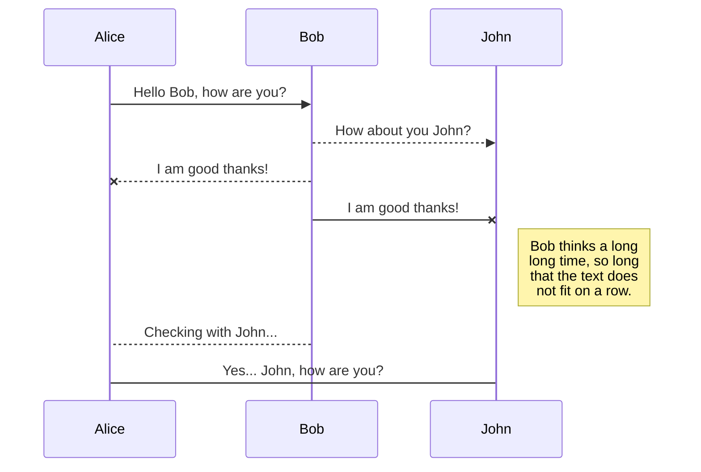
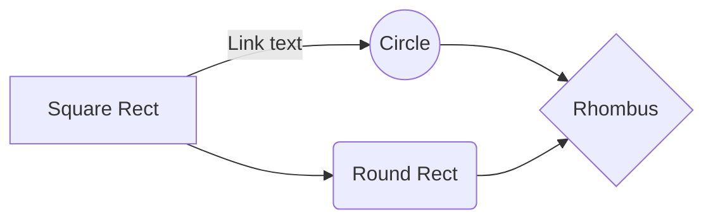

TenserFLow in Python (NN)
=============

What is it?
-------


1. Start with your input data
2. These input values are passed along, each of these input values are weighted
3. They are then sumed together
4. There is then a threshold/activation function (normaly a sigmod).
5. This then produces an output


$$
Y(\vec{x}) = f(\vec{x}\vec{{w}})
$$


1. All off your inputs are connected (IN the most basic model)
2. In the image above there are 3 hidden layers
3. This is know as a deep neural network as it has more then one hidden layer
4. In a deep neural network the optimaisation is a lot more difficult

The reason the deep neural networks are more difficult to train is they are very interdependent. Thus if you change one weight in one layer it could drastically effect the other layers. 

How it works
-------

TenserFlow
-------
### Installing TenserFlow

1. If you dont already have pip install pip.

#### Own Mac/Lunix

The bellow installation is made for CPU usasage only

```bash
pip install tensorflow
pip install tf-nightly
```


#### Docker Container

Docker has its own image

```bash
docker pull tensorflow/tensorflowarkup
```

To run it with a jupyter notebook:

```bash
docker run -it -p 8888:8888 tensorflow/tensorflow
```


Each of the 

## KaTeX

You can render LaTeX mathematical expressions using [KaTeX](https://khan.github.io/KaTeX/):

The *Gamma function* satisfying $\Gamma(n) = (n-1)!\quad\forall n\in\mathbb N$ is via the Euler integral

$$
\Gamma(z) = \int_0^\infty t^{z-1}e^{-t}dt\,.
$$

> You can find more information about **LaTeX** mathematical expressions [here](http://meta.math.stackexchange.com/questions/5020/mathjax-basic-tutorial-and-quick-reference).


## UML diagrams

You can render UML diagrams using [Mermaid](https://mermaidjs.github.io/). For example, this will produce a sequence diagram:



And this will produce a flow chart:




This library is the first step of a journey that every markup file in a repository goes on before it is rendered on GitHub.com:

1. This library converts the raw markup to HTML. See the list of [supported markup formats](#markups) below.
2. The HTML is sanitized, aggressively removing things that could harm you and your kin—such as `script` tags, inline-styles, and `class` or `id` attributes. See the [sanitization filter](https://github.com/jch/html-pipeline/blob/master/lib/html/pipeline/sanitization_filter.rb) for the full whitelist.
3. Syntax highlighting is performed on code blocks. See [github/linguist](https://github.com/github/linguist#syntax-highlighting) for more information about syntax highlighting.
4. The HTML is passed through other filters in the [html-pipeline](https://github.com/jch/html-pipeline) that add special sauce, such as [emoji](https://github.com/jch/html-pipeline/blob/master/lib/html/pipeline/emoji_filter.rb), [task lists](https://github.com/github/task_list/blob/master/lib/task_list/filter.rb), [named anchors](https://github.com/jch/html-pipeline/blob/master/lib/html/pipeline/toc_filter.rb), [CDN caching for images](https://github.com/jch/html-pipeline/blob/master/lib/html/pipeline/camo_filter.rb), and  [autolinking](https://github.com/jch/html-pipeline/blob/master/lib/html/pipeline/autolink_filter.rb).
5. The resulting HTML is rendered on GitHub.com.

Please note that **only the first step** is covered by this gem — the rest happens on GitHub.com.  In particular, `markup` itself does no sanitization of the resulting HTML, as it expects that to be covered by whatever pipeline is consuming the HTML.

Please see our [contributing guidelines](CONTRIBUTING.md) before reporting an issue.


The following markups are supported.  The dependencies listed are required if
you wish to run the library. You can also run `script/bootstrap` to fetch them all.

* [.markdown, .mdown, .mkdn, .md](http://daringfireball.net/projects/markdown/) -- `gem install commonmarker` (https://github.com/gjtorikian/commonmarker)
* [.textile](https://www.promptworks.com/textile) -- `gem install RedCloth` (https://github.com/jgarber/redcloth)
* [.rdoc](https://ruby.github.io/rdoc/) -- `gem install rdoc -v 3.6.1`
* [.org](http://orgmode.org/) -- `gem install org-ruby` (https://github.com/wallyqs/org-ruby)
* [.creole](http://wikicreole.org/) -- `gem install creole` (https://github.com/larsch/creole)
* [.mediawiki, .wiki](http://www.mediawiki.org/wiki/Help:Formatting) -- `gem install wikicloth` (https://github.com/nricciar/wikicloth)
* [.rst](http://docutils.sourceforge.net/rst.html) -- `pip install docutils`
* [.asciidoc, .adoc, .asc](http://asciidoc.org/) -- `gem install asciidoctor` (http://asciidoctor.org)
* [.pod](http://search.cpan.org/dist/perl/pod/perlpod.pod) -- `Pod::Simple::XHTML`
  comes with Perl >= 5.10. Lower versions should install Pod::Simple from CPAN.


Installation
-----------

```
gem install github-markup
```

Usage
-----

Basic form:

```ruby
require 'github/markup'

GitHub::Markup.render('README.markdown', "* One\n* Two")
```

More realistic form:

```ruby
require 'github/markup'

GitHub::Markup.render(file, File.read(file))
```

And a convenience form:

```ruby
require 'github/markup'

GitHub::Markup.render_s(GitHub::Markups::MARKUP_MARKDOWN, "* One\n* Two")
```


Contributing
------------

See [Contributing](CONTRIBUTING.md).